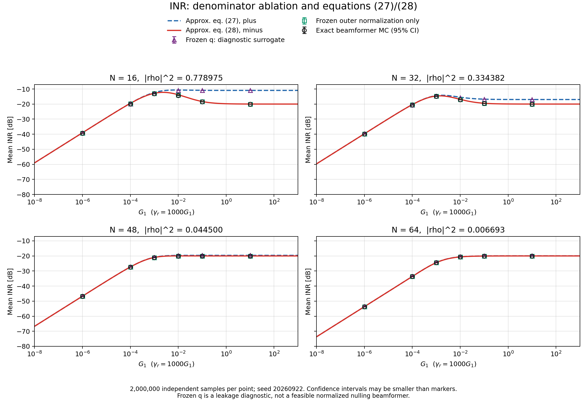

# INR 公式 (27)/(28) 的推导审计与数值验证

分析日期：2026-09-22。编号以现有 6 页 [main.pdf](../overleaf_ntn_paper/build/main.pdf) 及其 main.aux 为准。本文独立记录分析，不修改论文正文、原 notebook 或 PDF。

核对材料：[analysis.tex](../overleaf_ntn_paper/analysis.tex)、[proofs.tex](../overleaf_ntn_paper/proofs.tex)、[problem.tex](../overleaf_ntn_paper/problem.tex) 和 [verify_equations.ipynb](verify_equations.ipynb)。可复现实验位于 [inr_eq27_eq28_analysis](inr_eq27_eq28_analysis/)，下文同时给出证明、近似条件与数值证据。

## 1. 结论与证据的对应关系

**你定位到公式 (32) 是对的。主要问题是：在相消之前，把投影内部的随机分母 $\|\widehat h_1\|^2$ 换成了均值。它的相对波动虽然小，但它与分子同阶的随机项共同决定残余干扰；提前冻结分母会破坏抵消。**

需要区分三个结论：

1. 公式 (31) 以及精确零陷波束本身没有导致蓝线问题。将 (32) 内部分母冻结之后，再推导出 (27)，在该近似模型内部大体自洽。
2. 公式 (49) 中的 $1+|\rho|^2$，对公式 (36) 定义的那个随机变量确实正确。不能仅把这一行的正号改成负号；必须先修复近似的出发点。
3. 公式 (28) 可以从保持投影抵消关系的表达式重新近似推导出来，且有正确的高训练 SNR 极限。但它不是有限阵列、所有 SNR、所有相关系数下的精确期望。原图每点仅 50 次 MC，“视觉上重合”不足以证明精确相等。

独立验证采用每点 **2,000,000 次**样本、固定随机种子 20260922，共 48 个参数点。主图模型下，$N_t=16,\gamma_1^r=10$ 时，式 (28) 仍比精确波束的 MC 均值高约 **11.30% / 0.465 dB**；到高 SNR，正确平台则确实是 $-20$ dB，而式 (27) 给出 $-10.94$ dB。

## 2. 统一符号、模型与原图参数

下文为简化式子，将目标信道单位化；这不改变零陷波束：

$$
N=N_t\ge2,\quad u=\frac{h_0}{\|h_0\|},\quad h=h_1,\quad
v\sim\mathcal{CN}(0,\sigma^2I),\quad
\widehat h=h+v,\quad \sigma^2=\frac{N_0}{\mathcal E_r}.
$$

再记

$$
H=\|h\|^2=NG_1,\qquad
r=|\rho|^2=\frac{|u^Hh|^2}{H},\qquad
\gamma=\gamma_1^r=\frac{G_1}{\sigma^2},\qquad
k=\frac{\mathcal E_t}{\mathcal E_r}.
$$

所以 $H=N\sigma^2\gamma$。信道 $h_0,h_1$ 固定，期望只对估计误差取；目标信道完美已知，单个 victim，$\lambda=\infty$，每次都执行零陷。

原 notebook 使用的参数是：

| 项目 | 数值/意义 |
|---|---|
| 天线数 | $N=16,32,48,64$ |
| 阵元间隔 | $0.5\lambda$ |
| 目标/victim 角度 | $0^\circ/15^\circ$，阵列相位使用 cos |
| 训练长度、能量 | 100 个单位模样本，$\mathcal E_r=100$ |
| 数据能量 | $\mathcal E_t=1$ |
| 复噪声功率 | $N_0=0.1$ |
| 估计误差方差 | $\sigma^2=0.001$ |
| 原 notebook 的 gamma_h1 | 信道**振幅**，不是训练 SNR |
| 横轴 | $G_1=\texttt{gamma\_h1}^2$ |
| 训练 SNR | $\gamma=1000G_1$ |
| 原图 MC 次数 | 每点 50 次，没有固定 seed |

因此 $k=0.01$，其 dB 值是 $-20$ dB。

原图来自 notebook **cell 1 计算、cell 3 绘图（从 0 编号）**。Theory + 对应 (27)，Theory − 对应 (28)。代码变量 INR_theory_correct / INR_theory_incorrect 只是历史命名，不是正确性的判断。

把两式统一写成：

$$
I_+ =
k\frac{\gamma\{Nr+\gamma(1+r)\}}
{(1+\gamma)\{1+\gamma(1-r)\}},
\tag{A1}
$$

$$
I_- =
k\frac{\gamma\{Nr+\gamma(1-r)\}}
{(1+\gamma)\{1+\gamma(1-r)\}}.
\tag{A2}
$$

## 3. 精确起点：零陷投影恒等式

定义估计信道的正交补投影：

$$
P_{\widehat h}^{\perp}
=I-\frac{\widehat h\widehat h^H}{\|\widehat h\|^2},
\qquad
p=u^HP_{\widehat h}^{\perp}u
=1-\frac{|u^H\widehat h|^2}{\|\widehat h\|^2}.
$$

公式 (25) 等价于

$$
\widehat w=\frac{P_{\widehat h}^{\perp}u}{\sqrt p},
\qquad
\widehat w^Hh=\frac{F}{\sqrt p},
\qquad
F=u^HP_{\widehat h}^{\perp}h.
\tag{A3}
$$

只要 $p>0$，它满足

$$
\|\widehat w\|=1,\qquad \widehat w^H\widehat h=0.
$$

由于 $\widehat h=h+v$，还有一个**逐样本精确**的恒等式：

$$
P_{\widehat h}^{\perp}h=-P_{\widehat h}^{\perp}v,
\qquad
\widehat w^Hh=-\widehat w^Hv.
\tag{A4}
$$

这说明残余干扰只能由估计误差在实际波束方向上的分量产生。不能把波束与误差擅自当成独立，但可以利用 (A4) 在近似之前先完成正确相消。

也立即得到所有参数下的上界：

$$
|\widehat w^Hh|^2\leq\|v\|^2,\qquad
\mathbb E[\mathrm{INR}]\leq kN.
\tag{A5}
$$

这个上界采用无条件高斯估计误差模型；它不是所有条件检测模型的通用条件均值上界。

## 4. 公式 (32) 究竟丢掉了什么

令

$$
C=u^Hh,\quad d=u^Hv,\quad t=h^Hv,\quad q=\|v\|^2,
\quad T=\|\widehat h\|^2=H+t+t^*+q.
$$

公式 (31) 的括号可精确写成

$$
F=C-\frac{(C+d)(H+t^*)}{H+t+t^*+q}.
\tag{A6}
$$

### 4.1 保留随机分母的一阶展开

在固定 $N$、固定 $r<1$、高训练 SNR 下，保留关于估计误差的一阶项：

$$
\frac1T
=\frac1H-\frac{t+t^*}{H^2}
+\text{二阶及更高阶项}.
$$

代回 (A6)，有

$$
\begin{aligned}
F
&\approx C-
\left[C+d+\frac{Ct^*}{H}
-\frac{C(t+t^*)}{H}\right]\\
&=-d+\frac{Ct}{H}\\
&=-u^H\left(I-\frac{hh^H}{H}\right)v.
\end{aligned}
\tag{A7}
$$

记 $P_h^\perp=I-hh^H/H$。随机项的方差为

$$
\mathbb E|u^HP_h^\perp v|^2
=\sigma^2u^HP_h^\perp u
=\sigma^2(1-r).
\tag{A8}
$$

这里的负号来自真实投影消去平行于 $h$ 的误差分量。

### 4.2 提前冻结分母得到的随机项

如果先按照 (32) 把 $T$ 换成 $\mathbb ET=H+N\sigma^2$，那么在高 SNR 下，随机一阶项变为

$$
F_{\mathrm{fr}}\approx-d-\frac{Ct^*}{H}.
\tag{A9}
$$

对 proper complex Gaussian 误差，$\mathbb E[dt]=0$，所以

$$
\mathbb E|F_{\mathrm{fr}}|^2
\approx \sigma^2+
\frac{|C|^2}{H^2}\sigma^2H
=\sigma^2(1+r).
\tag{A10}
$$

从 (A9) 回到 (A7)，遗漏的修正恰好是

$$
\frac{C(t+t^*)}{H}.
\tag{A11}
$$

它不是可随意忽略的高阶项：其标准量级与 $d$、$Ct^*/H$ 相同。分母的**相对**扰动小，不代表最终两个大项相减后的**残余**误差小。

甚至在高 SNR 时，$T$ 越接近 $H$，原表达式里两个大项的抵消也越精确；只保留随机分子的扰动、删掉随机分母的对应扰动，恰恰会污染需要计算的噪声底。

### 4.3 这也是渐近展开不一致的问题

固定 $\gamma$、固定 $r>0$，让 $N$ 增大时，确定性残余功率可能是 $O(N)$，而两个公式的区别是 $O(1)$。因此一种近似可能在这个特定极限下有小相对误差。

但原图固定阵列后继续把 $\gamma$ 扫到很大：确定性偏置衰减，剩下的正是 $O(1)$ 噪声底。之前删掉的抵消此时决定主导项。所以“适用于大阵列”不能自动推出“对整个训练 SNR 范围一致准确”。

## 5. 为什么不是公式 (49) 简单算错了正负号

正文定义

$$
V_+=\frac{a+b^*}{m},\qquad
m=H+N\sigma^2,
$$

其中使用原来的未归一化 $h_0$：

$$
a=(h_0^Hv)H,\qquad
b=(h^Hh_0)(h^Hv).
$$

正确展开是

$$
|a+b^*|^2=|a|^2+|b|^2+ab+a^*b^*.
$$

$a,b$ 都是 proper Gaussian 向量 $v$ 的复线性函数，因此 $\mathbb E[ab]=0$。所需的是这个**伪协方差**等于零，不是普通协方差 $\mathbb E[b^*a]$ 等于零。复高斯协方差与伪协方差的区别可参见 [Gallager 的原始讲义](https://www.rle.mit.edu/rgallager/documents/CircSymGauss.pdf)。

事实上，一般有

$$
\mathbb E[b^*a]
=\sigma^2H(h_0^Hh)^2,
\quad\text{一般不为零。}
$$

但这不是上面 $|a+b^*|^2$ 展开的交叉项。因此公式 (49) 前那句话应更正，**(49) 的 $1+r$ 却不能因此改为 $1-r$**：

$$
\mathbb E|V_+|^2
=\frac{\sigma^2H^2\|h_0\|^2}{m^2}(1+r).
\tag{A12}
$$

要得到 $1-r$，必须换成经过正确相消后的随机变量

$$
V_-=\alpha h_0^HP_h^\perp v,\qquad
\alpha=\frac{H}{m}=\frac{\gamma}{1+\gamma},
$$

这时

$$
\mathbb E|V_-|^2=\alpha^2\sigma^2\|h_0\|^2(1-r).
\tag{A13}
$$

$V_+$ 与 $V_-$ 不是同一个随机变量。“逐项验证 $D,V,S$ 都对”只是在验证冻结分母后建立的新模型，并不能验证该新模型仍代表真实波束。

## 6. 如何从精确表达式重新推导公式 (28)

下面给出两条相互核对的路线。两条路线都先保留/完成零陷抵消，然后近似。

### 6.1 从误差投影恒等式出发

利用 (A4)，(A6) 可改写为

$$
F=-d+\frac{(C+d)(t+q)}T.
\tag{A14}
$$

令 $m=H+N\sigma^2,\alpha=H/m$。将噪声总能量 $q$ 与 $T$ 的主导尺度用于近似，保留所需线性误差项：

$$
\begin{aligned}
F_{\mathrm{red}}
&=C(1-\alpha)-\alpha d+\frac{Ct}{m}\\
&=C(1-\alpha)-\alpha u^HP_h^\perp v.
\end{aligned}
\tag{A15}
$$

其确定项与零均值随机项的交叉期望为零，所以

$$
\mathbb E|F_{\mathrm{red}}|^2
=Hr(1-\alpha)^2+\alpha^2\sigma^2(1-r).
\tag{A16}
$$

再取外部归一化 $p\approx1-\alpha r$，得到

$$
\begin{aligned}
\mathbb E[\mathrm{INR}]
&\approx\frac{\mathcal E_t}{N_0}
\frac{Hr(1-\alpha)^2+\alpha^2\sigma^2(1-r)}
{1-\alpha r}\\
&=k\frac{\gamma\{Nr+\gamma(1-r)\}}
{(1+\gamma)\{1+\gamma(1-r)\}},
\end{aligned}
\tag{A17}
$$

正是公式 (28)。

这条路线可以明确写出被舍弃的项。令

$$
\delta=T-m=t+t^*+q-N\sigma^2,
$$

则有**精确余项恒等式**：

$$
F-F_{\mathrm{red}}
=
\frac{dt}{m}
+\frac{(C+d)(q-N\sigma^2)}m
-\frac{(C+d)(t+q)\delta}{mT}.
\tag{A18}
$$

因此 (A17) 是有明确余项的近似，不是把 (A6) 等价改写就能得到的精确均值。固定非退化几何、训练 SNR 足够高时，这些余项不影响主导噪声底；小阵列、低 SNR、极弱相关或近共线时不能不加判断地忽略。

### 6.2 先精确消去大项，再对两个正范数近似

为了更直接说明“近似顺序”的作用，选取正交基并吸收无关整体相位：

$$
h=\sqrt H\,e_1,\qquad
u=\sqrt r\,e_1+\sqrt{1-r}\,e_2,
$$

$$
v=\zeta e_1+\xi,\qquad
e_1^H\xi=0,\qquad x=e_2^H\xi,\qquad Q=\|\xi\|^2.
$$

其中 $\zeta\sim\mathcal{CN}(0,\sigma^2)$ 与 $\xi$ 独立，$Q/\sigma^2\sim\mathrm{Gamma}(N-1,1)$。

不作任何近似，将 (A6) 通分、相消，可得：

$$
F=
\frac{\sqrt H\{\sqrt r\,Q-\sqrt{1-r}\,x(\sqrt H+\zeta)^*\}}T.
\tag{A19}
$$

令 $U=T-|u^H\widehat h|^2=\|P_u^\perp\widehat h\|^2$，精确泄漏为

$$
|\widehat w^Hh|^2
=
\frac{
H\left|\sqrt r\,Q-\sqrt{1-r}\,x(\sqrt H+\zeta)^*\right|^2
}{TU}.
\tag{A20}
$$

现在分子已经完成必要相消，没有两个 $O(\sqrt H)$ 大项相减的问题。其二阶矩可精确计算：

$$
\begin{aligned}
\mathbb E Q^2&=N(N-1)\sigma^4,\\
\mathbb E|x|^2&=\sigma^2,\\
\mathbb E|\sqrt H+\zeta|^2&=H+\sigma^2,\\
\mathbb E[Qx^*(\sqrt H+\zeta)]&=0.
\end{aligned}
$$

故 (A20) 分子的精确期望为

$$
H\sigma^4\{rN(N-1)+(1-r)(N\gamma+1)\}.
\tag{A21}
$$

两个分母的均值是

$$
\mathbb ET=N\sigma^2(1+\gamma),\qquad
\mathbb EU=\sigma^2\{N-1+N\gamma(1-r)\}.
$$

此时才使用“比值的期望约等于分子期望除以分母均值乘积”，得到一个仍非精确的有限 $N$ 近似：

$$
I_{\mathrm{ratio}}
=
k\gamma\,
\frac{r(N-1)+(1-r)(\gamma+1/N)}
{(1+\gamma)\{1-1/N+\gamma(1-r)\}}.
\tag{A22}
$$

再忽略分母中的 $1/N$、分子中相对主导项较小的 $-r$ 和 $(1-r)/N$，便得到 (28)。

这条路线表明：**同样使用集中近似，先精确相消再近似，与在 (32) 先冻结投影内部分母，并不等价。**

(A22) 仍忽略分子、$T$、$U$ 的相关性，不能宣称它在每一点都优于 (28)。它的作用是明确列出近似层次；$r=0$ 等边界中被舍弃的有限 $N$ 项甚至会成为主导项。

## 7. 正确高 SNR 平台、阵列相关性与尖峰

### 7.1 高 SNR 平台可以不依赖任何分母均值近似来证明

固定 $r<1$。当真实 victim 信道沿固定方向增强时，

$$
\widehat w\longrightarrow
w_0=\frac{P_h^\perp u}{\sqrt{1-r}}.
$$

由精确恒等式 (A4)，$\widehat w^Hh=-\widehat w^Hv\to-w_0^Hv$。因为 $|\widehat w^Hv|^2\leq\|v\|^2$ 且后者可积，可以交换此极限与期望：

$$
\lim_{\gamma\to\infty}\mathbb E|\widehat w^Hh|^2
=\mathbb E|w_0^Hv|^2=\sigma^2.
$$

所以

$$
\boxed{\lim_{\gamma\to\infty}\mathbb E[\mathrm{INR}]=k,\qquad r<1.}
\tag{A23}
$$

对应两条理论曲线：

$$
\lim_{\gamma\to\infty}I_-=k,\qquad
\lim_{\gamma\to\infty}I_+=k\frac{1+r}{1-r}.
\tag{A24}
$$

公式 (27) 和正文公式 (30) 的高 SNR 结论本身就不相容。

### 7.2 直接计算原图四种阵列的相关系数

原阵列中

$$
r_N=
\left|
\frac1N\sum_{n=0}^{N-1}
e^{j\pi n(\cos0^\circ-\cos15^\circ)}
\right|^2.
$$

| $N$ | $r_N$ | (27) 的高 SNR 平台 | 真实/(28) 平台 | (27) 平台偏高 |
|---:|---:|---:|---:|---:|
| 16 | 0.7789749591 | −10.9427 dB | −20 dB | 9.0573 dB |
| 32 | 0.3343819580 | −16.9794 dB | −20 dB | 3.0206 dB |
| 48 | 0.0445002626 | −19.6132 dB | −20 dB | 0.3868 dB |
| 64 | 0.0066933890 | −19.9419 dB | −20 dB | 0.0581 dB |

这精确解释了截图的趋势：小阵列的两个信道相关性强，被错误保留下来的平行误差能量经过 $1/(1-r)$ 归一化后被放大；48/64 根天线时 $r$ 很小，正负号的差别也很小。

这里不是“阵列变大后原推导忽然完全正确”，而是此几何配置下 $r_N$ 变小，使错误变得不显眼。

### 7.3 为什么真实曲线先升高，再回落到噪声底

在 (28) 中，确定性泄漏与随机误差分别贡献

$$
I_{\mathrm{bias}}
=k\frac{Nr\gamma}{(1+\gamma)\{1+\gamma(1-r)\}},
$$

$$
I_{\mathrm{noise}}
=k\frac{\gamma^2(1-r)}{(1+\gamma)\{1+\gamma(1-r)\}}.
$$

第一项先上升，最终按 $1/\gamma$ 衰减；第二项最终趋于 $k$。强相关时第一项会把总 INR 推到噪声底之上，之后随着估计更准确而回落。错误公式 (27) 给第二项加上了错误的相关性放大系数，因而回落到过高的平台。

对于 (28) 的 $0<r<1$ 情形，其导数符号由

$$
Nr+2(1-r)\gamma+(1-r)\{2-(N+1)r\}\gamma^2
$$

决定。因此红式出现唯一峰值的条件是

$$
(N+1)r>2.
\tag{A25}
$$

这是**红式的峰值条件**，不是对有限 $N$ 精确 MC 曲线的额外定理。原图参数下：

| $N$ | 红式峰值对应 $\gamma$ | 对应 $G_1$ | 红式峰值 |
|---:|---:|---:|---:|
| 16 | 2.3303 | 0.0023303 | −12.2227 dB |
| 32 | 1.4492 | 0.0014492 | −14.5429 dB |
| 48 | 12.1028 | 0.0121028 | −19.9689 dB |
| 64 | 无内部峰值 | — | 单调趋于 −20 dB |

48 根天线的红式其实也有极小的峰，但只比平台高约 0.031 dB，原图尺度与 MC 波动下基本不可见。

## 8. 独立数值验证：把 (32) 的两个近似拆开

### 8.1 实验定义

令 $F$ 为精确 (A6)，$p=1-|u^H\widehat h|^2/T$，以及

$$
F_m=C-\frac{(u^H\widehat h)(\widehat h^Hh)}m,
\qquad \bar p=1-\mathbb E|\widehat\rho|^2.
$$

分别计算：

| 名称 | 每个样本使用的泄漏功率 |
|---|---|
| exact beamformer MC | $|F|^2/p$ |
| 只冻结外归一化 | $|F|^2/\bar p$ |
| 只冻结内部范数 | $|F_m|^2/p$ |
| 两处都冻结，即 (32) | $|F_m|^2/\bar p$ |

最后统一乘 $\mathcal E_t/N_0$。后三种是诊断近似，不能当成另外三个满足真实零陷约束的波束。

这里 $\bar p$ 用有限 $N$ 的精确方向均值计算，避免把公式 (44) 的近似混进消融实验。具体为

$$
b_N=\mathbb E\frac1{K+N}
=\int_0^1x^{N-1}e^{-N\gamma(1-x)}\,dx
=\frac{{}_1F_1(1;N+1;-N\gamma)}N,
\quad K\sim\operatorname{Poisson}(N\gamma),
$$

$$
\mathbb E|\widehat\rho|^2
=r[1-(N-1)b_N]+(1-r)b_N.
\tag{A26}
$$

当 $\gamma=0$ 时，它恰好为 $1/N$。

实验通过旋转不变性，把 $N$ 维噪声精确缩减为两个独立复高斯标量和一个 $\mathrm{Gamma}(N-2,\sigma^2)$ 的剩余能量。没有引入新的信道近似。原 LS 估计误差满足

$$
v=\mathbf N_{\mathrm{train}}X^*/\mathcal E_r\sim\mathcal{CN}(0,N_0/\mathcal E_r\,I),
$$

这里 $\mathbf N_{\mathrm{train}}$ 表示 notebook 的训练噪声矩阵；直接生成这个高斯误差与原训练过程同分布。

### 8.2 结果

下面均为 dB，采用 $10\log_{10}(\text{线性样本均值})$，不是对 dB 值求平均：

| $N$ | $\gamma$ | exact MC | 只冻结外层 | 只冻结内层 | 两处冻结 | (27) | (28) |
|---:|---:|---:|---:|---:|---:|---:|---:|
| 16 | 1 | −13.0770 | −12.8647 | −12.8559 | −12.6164 | −12.3417 | −12.8448 |
| 16 | 10 | −14.2788 | −13.9359 | −10.9264 | −10.8045 | −10.6716 | −13.8139 |
| 16 | 100 | −18.5520 | −18.3754 | −10.9190 | −10.9044 | −10.8840 | −18.2933 |
| 16 | $10^4$ | −19.9818 | −19.9790 | −10.9417 | −10.9416 | −10.9421 | −19.9780 |
| 32 | $10^4$ | −19.9988 | −19.9984 | −16.9715 | −16.9714 | −16.9771 | −19.9941 |

例如 $N=16,\gamma=10$，精确 MC 的线性均值与一个标准误为

$$
0.0373354036\pm0.0000155994.
$$

式 (28) 为 0.0415539653；其差异远大于 MC 误差。$N=16,\gamma=10^4$ 时，真实结果是

$$
0.0100420442\pm0.0000071071,
$$

只冻结内部分母则得到 0.0805059312，直接恢复错误高平台。

**因此：高 SNR 下只冻结外部归一化几乎不改变结果；只冻结内部分母已经足以制造蓝线平台。**

“两处冻结”在有限 SNR 不必与 (27) 完全相等，因为 (33)–(49) 还做了二次误差替换均值、忽略 $1/N$ 等额外近似。例如，使用单位 $u$，冻结模型分子的精确二阶矩为

$$
\mathbb E|F_m|^2
=
|C|^2\left(\frac{(N-1)\sigma^2}m\right)^2
+\frac{\sigma^2H^2(1+r)}{m^2}
+\frac{\sigma^4H}{m^2}.
\tag{A27}
$$

这可作为独立于真实波束的解析校验。它仍保留错误高 SNR 平台，说明补回这些有限 $N$ 项并不能修复 (32) 的主要问题。

上图的理论曲线为连续函数；MC 和消融只在选定点计算。误差棒为 95% 正态近似置信区间，不能把点间连线视为另外执行过的 MC。

## 9. 为什么不能把公式 (28) 写成有限阵列精确结果

### 9.1 低训练 SNR 的精确首项

当 $\gamma\to0$ 时，估计信道方向趋于各向同性噪声方向。此时对于 $N>1$，

$$
\lim_{\gamma\to0}\mathbb E[\widehat w\widehat w^H]
=\frac{N-1}{N}uu^H
+\frac1{N(N-1)}(I-uu^H).
$$

从而真实 INR 的首项为

$$
\mathbb E[\mathrm{INR}]
=
k\gamma\left[(N-1)r+\frac{1-r}{N-1}\right]+o(\gamma).
\tag{A28}
$$

而 (28) 的首项是 $kNr\gamma$。对于本图强相关、小但非零 $\gamma$，差别主要是有限 $N$ 修正；若 $r=0$，差别却改变了主导阶：

$$
I_{\mathrm{true}}\sim\frac{k\gamma}{N-1},
\qquad
I_-\sim k\gamma^2.
$$

因此正交真实信道下，不能用式 (28) 的低 SNR 行为代替精确结果。

### 9.2 两个可以无 MC 计算的有限阵列边界

令 $K\sim\operatorname{Poisson}(N\gamma)$。可得到

$$
r=0:\quad
\frac{\mathbb E|\widehat w^Hh|^2}{H}
=
\mathbb E\frac{K+1}{(K+N-1)(K+N)},
\tag{A29}
$$

$$
r=1:\quad
\frac{\mathbb E|\widehat w^Hh|^2}{H}
=
\mathbb E\frac{N-1}{K+N}.
\tag{A30}
$$

推导要点：沿 $h$ 的带均值复高斯能量满足
$|\sqrt H+v_1|^2/\sigma^2\mid K\sim\mathrm{Gamma}(K+1,1)$；
其它坐标能量独立为 Gamma。对 $r=0$，取 $u=e_2$，写成两个独立 Gamma 比值期望之差；
对 $r=1$，泄漏是 $H$ 乘正交噪声能量占总能量的比例，直接取条件均值。

举例，$N=16,r=0,\gamma=0.001$ 时，

$$
\frac{I_{\mathrm{true}}}{k}=6.74808489824\times10^{-5},
\qquad
\frac{I_-}{k}=9.98002996005\times10^{-7}.
$$

这些是 Poisson 求和得到的数值，不依赖 MC 波动。

完全共线的 $r=1$ 也不能由“投影噪声项为零”推出泄漏为零。此时无误差极限下目标波束本身退化，外归一化同时趋零，必须联合处理：

$$
r=1,\ \gamma\to\infty:
\qquad I_{\mathrm{true}}\to k(N-1),\quad I_-\to kN.
\tag{A31}
$$

固定 $r<1$ 时 (A23) 的 $k$ 极限，与先令 $r=1$ 的极限不一样；这两个极限不能交换。

## 10. 原 notebook 的逐项验证存在什么问题

### 10.1 主图 MC 本身正确

cell 1 中：

- LS 估计使用真实缩放信道，误差方差是 $N_0/\mathcal E_r$。
- 波束归一化和共轭关系正确。
- 主 INR 使用固定 $N_0=0.1$。
- cell 3 是先在线性功率域平均、再转 dB。

独立 $N$ 维实现检查了单位范数和估计信道零陷：误差都在约 $10^{-15}$ 以内。所以主图的蓝红差异不是主 MC 归一化或平均顺序造成的。

### 10.2 cell 1 后半段的 V 诊断把共轭写反了

第一处累计的正确分子是

$$
(h_0^Hv)\|h\|^2+(h_0^Hh)(v^Hh).
$$

后面重新构造 num_V_samples 时，第二项却写成

$$
(h_0^Hh)(h^Hv),
$$

即把 $v^Hh$ 换成了其共轭 $h^Hv$。随后又用这组样本的均值覆盖先前正确累计的 EV2。

这个错误版本的线性随机项方差因子是 $1+3r$，不是正文冻结分母模型的 $1+r$，也不是正确投影近似的 $1-r$。因此 cell 2 中由 INR4_pow、INR5_pow 画出的逐项诊断曲线不能用来验证 (36)/(49)。

它**不影响 cell 3 的 MC / Theory + / Theory − 主图**，因为后者没有使用这些诊断量。

另外，把 S0、D0 中的随机量替换成样本均值后再相乘，本身已经是在测试近似模型，而不是精确恒等式；增加 MC 次数不会恢复被删掉的相关性。

### 10.3 旧 cell 与执行顺序

cell 0 是另一套早期实现，存在：

- 以每次观测到的训练噪声能量代替固定 $N_0$；
- D0/V0 等诊断有些位置用未乘 gamma 的 h1，而 h1_hat 对应缩放后的真实信道；
- 多个同名数组是三维，cell 1 又将它们改成二维。

因此 cell 6–9 依赖旧数组结构，不能在运行 cell 1 后直接视为同一个实验。当前 notebook 不能简单 Run All 后就保证重现历史图。

本机 NumPy 2.4.6 还不再接受某些 $(1,1)$ 数组直接赋给标量位置的旧写法；重构时应明确取 .item()。本次没有改原 notebook，而是提供独立脚本。

### 10.4 50 次 MC 与大动态范围

高 SNR 下，泄漏近似复高斯模平方，单点 50 次平均的相对标准误约 $1/\sqrt{50}=14.1\%$，换算 dB 约 0.61 dB。小于此量级的系统误差很容易在图上看起来“完全重合”。

在原图最大的信道幅度处，还应避免直接求两个很大的近抵消量；独立脚本在高 SNR 采用 $\widehat w^Hh=-\widehat w^Hv$。这只是数值稳定措施，不会把蓝式自动变成红式。

## 11. 全文其它需要记录的问题

这些问题已记录，**本次不修改论文**。

| 位置 | 检查结果及建议 |
|---|---|
| (1)–(10) | LS 误差模型、单位范数特征向量解与本次单 victim 零陷模型相容。有限 $\lambda$ 与强制零陷是不同工作点，当前图验证的是后者。 |
| (12) | 源码把目标 SNR 写成含 $h_0^2$ 的模值，正常应为 $\lvert\widehat w^Hh_0\rvert^2$；右侧 $NG_0\mathcal E_t/N_0$ 与后者一致。 |
| (12)/(13) | 两式重复使用 eq:snr_nonull 标签，会使交叉引用含糊。 |
| (16)–(20) | 复高斯能量到标准实卡方分布的因子 2 不一致，见下文。 |
| (21)–(26) | 单 victim、完美目标信道、非退化几何下的投影波束正确。$r=1$ 的完美信道公式需要单独处理。 |
| (27)/(30) | (27) 的高 SNR 极限不等于 (30)；(28) 在固定 $r<1$ 时与 (30) 一致。 |
| (32) | 内部范数冻结破坏一阶抵消，是本问题的主要来源。 |
| (35)–(37) | 替换二次误差项为均值又增加了一层近似；在已冻结的 $D,V$ 模型中，$D$ 确定且 $\mathbb EV=0$ 才允许去掉其交叉均值。不能把同一说法直接用于精确随机分母模型。 |
| (39)/(42) | $B_i$ 与 $B_{ij}$、$\alpha_i$ 与固定下标 1 混用，应统一。 |
| (43) | $\mathbb E\|\widehat h\|$ 与 $\sqrt{\mathbb E\|\widehat h\|^2}$ 不相等，中间的等号需保留为近似。 |
| (44)/(45) | (44) 是比值近似，并非精确 $\mathbb E\lvert\widehat\rho\rvert^2$；(45) 又删去了 $1/N$。它们会带来有限阵列误差，但不是错误高 SNR 平台的主因。 |
| (47) | 从保留有限 $N$ 的 $D$ 到最后一行，实际删掉了 $(1-1/N)^2$ 因子。 |
| (48)/(49) | 交叉项应讨论 $\mathbb E[ab]$，不是 $\mathbb E[b^*a]$；对已定义的 $V_+$，最终正号正确。 |
| (49) 分母 | 由 $V_+$ 平方得到的是 $(\mathbb E\|\widehat h\|^2)^2$，不是 $\mathbb E\|\widehat h\|^4$。后者比前者多 $N\sigma^4+2\sigma^2H$。 |
| (54) | 切向扰动表达式需说明高 SNR 与相位对齐条件；右侧不是严格单位向量，其期望范数平方为 $1-\sigma^2/m$。 |
| (56)–(58) | 与上文保持投影结构的红式近似一致，可从 (A14) 给出更明确推导及余项。 |
| (59) | 又把 $V$ 定义成 (36) 的 $V_+$，与 (57) 的 $V_-$ 不相同，应改用不同符号，不能当作连续等价变形。 |
| 图和章节引用 | fig:interference_mitigation、sec:nullone 的定义缺失；对应附录推导目前在源码中被注释。 |

关于 (35) 中二次误差项
$W=(h_0^Hv)(v^Hh)$，有

$$
\mathbb EW=\sigma^2h_0^Hh,\qquad
\operatorname{Var}(W)=\sigma^4\|h_0\|^2H.
$$

所以“其方差很小”需要给出归一化和适用尺度，不能理解成方差为零。弱相关或低 SNR 时，该类项可能正是领先误差来源。

关于 (54)，真实的单位方向高 SNR 一阶展开含有

$$
\widehat u_h
=u_h+
\frac{P_h^\perp v+j\,u_h\,\operatorname{Im}(u_h^Hv)}{\sqrt H}
+\text{高阶项}.
$$

只在先对齐整体相位时，才可省去纯相位项；投影算子对整体相位不敏感，但单位方向向量本身敏感。

### 11.1 检测分布的因子 2

在论文使用的约定 $w\sim\mathcal{CN}(0,N_0I)$ 下，每个实部/虚部的方差都是 $N_0/2$。所以

$$
\mathcal H_0:\qquad
\frac{2T}{N_0}\sim\chi^2_{2N},
\quad\text{等价于}\quad
\frac{T}{N_0}\sim\mathrm{Gamma}(N,1).
$$

正文公式 (17) 的指数乘有限级数正好与这个 Gamma 分布一致，是正确的；(16) 少了因子 2。

若 $\gamma_{\mathrm{det}}=\mathcal E_U\|h\|^2/N_0$，则

$$
\mathcal H_1:\quad
\frac{2T}{N_0}\sim\chi'^2_{2N}(2\gamma_{\mathrm{det}}),
$$

$$
P_D=Q_N\left(\sqrt{2\gamma_{\mathrm{det}}},\sqrt{2\tau/N_0}\right),
$$

$$
P_{MD}
=F_{\chi'^2_{2N}(2\gamma_{\mathrm{det}})}(2\tau/N_0).
$$

这与 [SciPy 官方 ncx2 的标准参数化](https://docs.scipy.org/doc/scipy/reference/generated/scipy.stats.ncx2.html) 一致。因此 (18)–(20) 若按标准实卡方/Marcum-Q 定义，应一并调整，而不能只改一个参数。

### 11.2 “检测到 victim”与无条件估计误差平均

正文 IV-C 用“检测到 victim”引出估计误差分析，但原 notebook 并没有模拟检测失败，而是始终执行零陷。

若检测和估计复用同一段前导，则事件

$$
D=\{\|\widehat h\|^2>\tau/\mathcal E_U\}
$$

会改变估计误差的条件分布。完整系统的平均 INR 应为

$$
P_D\,\mathbb E[\mathrm{INR}_{\mathrm{null}}\mid D]
+P_{MD}\,\mathrm{INR}_{\mathrm{nonull}}.
$$

不能无条件地把式 (28) 乘 $P_D$，然后声称已经计入检测选择效应。当前图及本文主推导只针对无条件误差、始终执行零陷的实验。这是模型适用范围问题，与 (32) 的分母问题分开。

## 12. 后续论文修改建议与本次交付

后续若修改正文，建议按以下顺序：

1. 保留 (31) 精确投影式，紧接着写出 $\widehat w^Hh=-\widehat w^Hv$。
2. 用第 6 节路线推导 (28)，明确写成近似，说明单 victim、完美目标信道、无条件高斯估计误差及近似适用范围。
3. 给出固定 $r<1$ 的严格高 SNR 极限，而不是依赖均值分母近似证明噪声底。
4. 删除或重新组织 (32)–(50) 的旧近似链；若保留作为失败近似示例，不能把其 $V_+$ 与新推导的 $V_-$ 混用。
5. 单独修正检测分布参数、符号/交叉引用及 notebook 诊断代码；这些不应伪装成此次正负号问题的根因。
6. 用更多 MC 样本和置信区间报告红式的残余误差，而不是表述为有限阵列精确重合。

本次只创建分析与独立验证文件，未改动原 main.tex、analysis.tex、proofs.tex、verify_equations.ipynb 或 build/main.pdf。

复现数值实验：

    cd "/home/shizhen/my_project/ntn-nulling-journal/Single user"
    python inr_eq27_eq28_analysis/verify_inr_approximations.py

已有结果保存在 [results.json](inr_eq27_eq28_analysis/results.json)，可仅重绘：

    python inr_eq27_eq28_analysis/verify_inr_approximations.py --plot-only

随机模拟的 seed、样本数、每点线性均值、标准误、理论值与冻结模型解析校验值均随结果保存。独立实验不会执行或覆盖原 notebook，不会触发论文编译。
